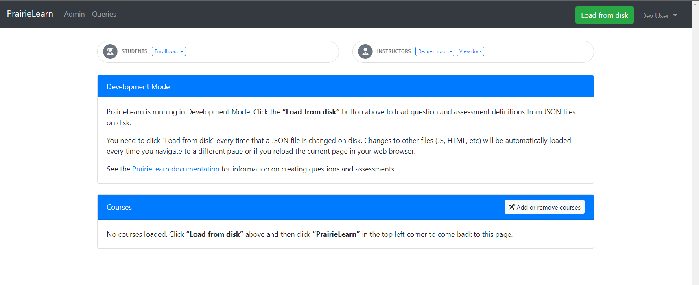
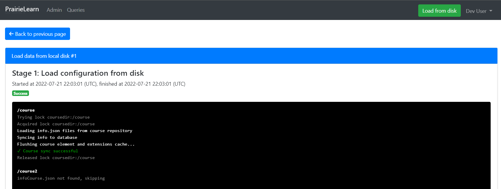

# Building an Autograding Question System with PrairieLearn

---

## Project Objective
The objective of this project is to amend PrairieLearn's capabilities to support set of UML Generation Questions. It is also our aim to deploy this on a server to be used by The University of British Columbia.

---

## Documentation Links
- [PrairieLearn Documentation](https://prairielearn.readthedocs.io/en/latest/)
- [Docker Deployment Information](#deployment-information)
- [Dockerized Production Deployment Information](docs/running-in-production/setup.md)
- [Authentication Information](docs/running-in-production/authentication.md)
- [Admin User](docs/running-in-production/admin-user.md)
- [UML Question Creation](docs/elements/uml-generation.md)
- [Testing Information](docs/uml-testing.md)


---

## Project Team Roles
- Project Manager (Luis Lucio)
- Client Liaison (Emiel van der Poel)
- Integration Lead (Prajeet Didden)
- Technical Lead (Siqiao Yuan)

---

## Client Information For IP Transfer Agreement
- Legal Company Name: The University of British Columbia
- Company Mailing Address: 3187 University Way, Kelowna BC, V1V 1V7
- Company Contact: Ramon Lawrence
- E-mail Address: ramon.lawrence@ubc.ca
- Telephone Number: (250)807-9390

---

### Deployment Information

#### Prerequisites
>+ Docker: [Download Docker](https://www.docker.com/products/docker-desktop/)

#### Clone The Git Repository
````sh
git clone https://github.com/UBCO-COSC-499-Summer-2022/building-an-auto-grading-question-system-project-3-auto-grading-question-system.git
````

#### Navigate Into Project
````sh
cd building-an-auto-grading-question-system-project-3-auto-grading-question-system
````

#### Deploy Dev Environment onto localhost:3000

```sh
docker compose up
```

- Once docker-compose up is completed you should be greeted by the prairieLearn home page. From there to load in your courses you can press the "Load From Disk" in the top right.


- Once load from disk is complete, courses properly mounted will be visible to access.



