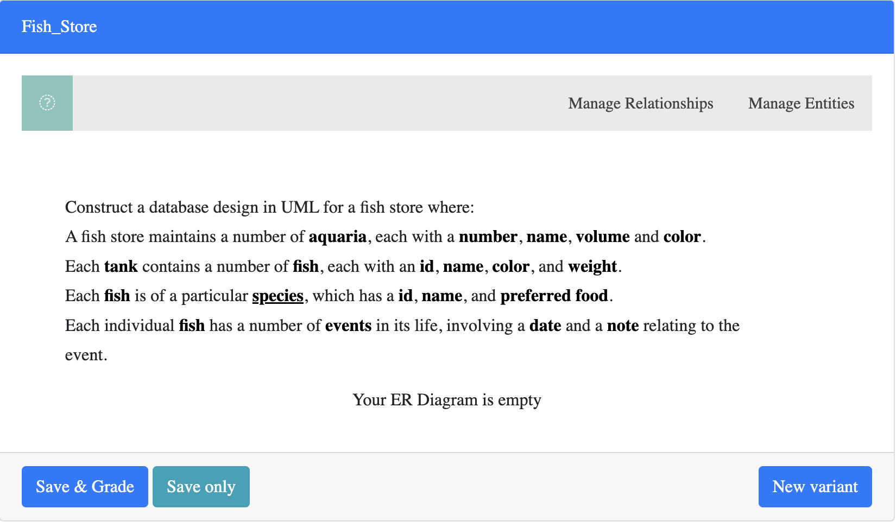
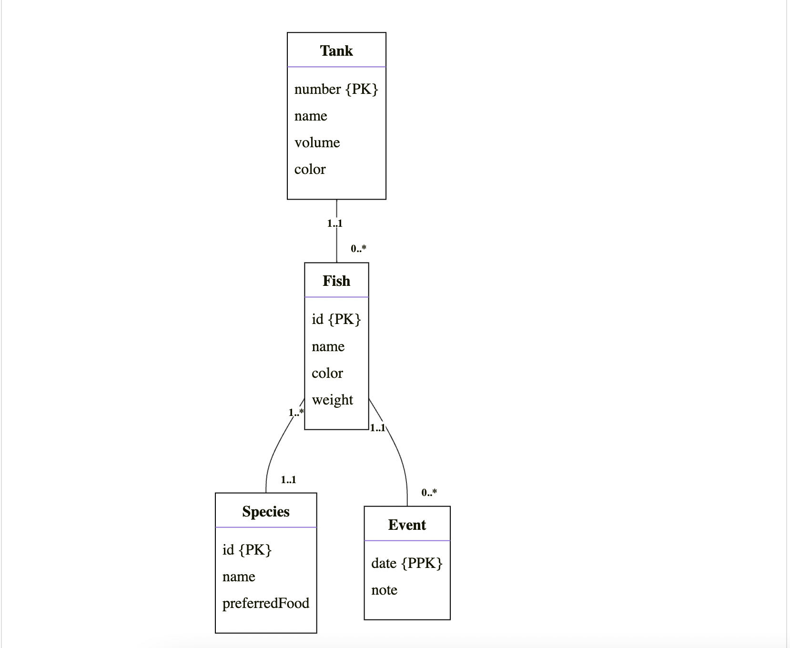

# UML Question Generation

- To create a uml question it will use a custom element we created in PrairieLearn called ```pl-uml-element```.

---

## Question Structure.

- The general structure follows the format of a html document. An Example of a question is shown below:
````
<pl-uml-element random="False" max-grade = "10">
    <uml-question>Construct a database design in UML for a fish store where:
        A fish store maintains a number of [aquaria](tank), each with a [number](number), [name](name), [volume](volume) and [color](color).
        Each [tank](tank) contains a number of [fish](fish), each with an [id](id), [name](name), [color](color), and [weight](weight).
        Each [fish](fish) is of a particular [species](species), which has a [id](id), [name](name), and [preferred food](preferredFood).
        Each individual [fish](fish) has a number of [events](event) in its life, involving a [date](date) and a [note](note) relating to the event.</uml-question>
    <uml-answer>[Tank|number {PK};name;volume;color]
[Fish|id {PK};name;color;weight]
[Species|id {PK};name;preferredFood]
[Event|date {PPK};note]
[Tank] 1..1 - 0..* [Fish]
[Fish] 1..* - 1..1 [Species]
[Fish] 1..1 - 0..* [Event]</uml-answer>
    <uml-marking entity-name="0.2" entity-attributes="0.1" entity-key="0.2" extra-entity-penalty="0.25" weak_entity="0.5" relationship="0.5" cardinality="0.25" extra-relationship-penalty="0.25"></uml-marking>
</pl-uml-element>
````
---
### `<pl-uml-element>`
- This represents the parent element that is required to generate the uml question. 
- Inside this element tag you can have two optionals:
   - _**random**_: This takes in a boolean value that can be set to `True` or `False`. If set to `True`, then the question will be generated with a random question and correlated answer. If set to `False`, than you must have the `uml-question` and the `uml-answer` inside the `pl-uml-element` specifying the question and answer.
   - _**max-grade**_: This takes in an integer value that will set the questions max weighting.
   - _**feedback**_: This takes in a boolean value that can be set to `True` or `False`. If set to `True`, then the question will autogenerate feedback on each attempt so the user can see where they are loosing marks. If set to `False` the system will not display the feedback for the users.
   - _**marker-feedback**_: This takes in a boolean value that can be set to `True` or `False`. If set to `True`, then the system will display a detailed breakdown of where the user made mistakes on their final attempt. If set to `False` the system will not display this information at all.
- If the `random` optional is set to false, than it is required to have the `uml-question` element tag inside as well as the `uml-answer` element tag inside.

---

### `<uml-question>`
- This element consists of a String that represents the uml question to be generated. The String contains the full question but for the interactable elements for entities and attributes you want to put the visible name in the question in square brackets such as `[aquaria]` and how this entity or attribute is displayed as in the uml diagram is done with `(tank)`, which is directly following. 
- This sample would be visible as `aquaria` in the question but will be displayed in the uml as `tank`.

---


### `<uml-answer>`
- This element takes in a string that will be used as the answer key when comparing to the users answer. Grading is calculated by two categories:
   - #### `Entities`: Entire Entities and its attributes can be represented as the following syntax: `[EntName|attr {PK};attr;attr]`
     - `[` Starts the entity.
     - `EntName` represents the entities name.
     - `|` separates the entity from its attributes and then the attributes can be seperated by `;`.
     - `attr` represents the attributes of the entity.
     - `{PK} OR {PPK}` represents the entities Primary or Partial Primary key's.
     - `]` Ends the entity.
     - _**An Example of an Entity would be**_ `[Fish|id {PK};name;color;weight]`.
   - #### `Relationships`: Relationships between entities can be handled by the following syntax: `[EntName1] Cardinality - Cardinality [EntName2]`
     - `[EntName]`: Represents an entity in the relation
     - `Cardinality`: This represents the cardinalities of the relationships. Cardinalities can be:
       - `0..1`: Zero to one.
       - `0..*`: Zero to many.
       - `1..1`: One to one.
       - `1..*`: One to many.
     - _**An Example of a relationship would be**_ `[Tank] 1..1 - 0..* [Fish]`.

---

### `<uml-marking>` 
- This element is not required for the `pl-uml-element` but if stated, can be used to alter the weighting of the different parameters used for marking uml questions. The Following parameter optionals can be changed:
  - `entity-name`: This would represent the marks given for getting the correct entity name.
  - `entity-attributes`: This would represent the marks given for getting the correct attribute for an entity.
  - `entity-key`: This would represent the marks given for getting the correct key for a given entity.
  - `extra-entity-penalty`: This would represent the deduction of marks if extra attributes were given to an entity.
  - `weak-entity`: This would represent the marks given for getting the correct weak entity.
  - `relationship`: This would represent the marks given for getting the relationship correct between two entities.
  - `cardinality`: This would represent the marks given for have the correct cardinality set for a relationship.
  - `extra-relationship-penalty`:This would represent the deduction of having an extra relationship that does not belong.

---

## Example Question Output


---

## Example User Answer 



