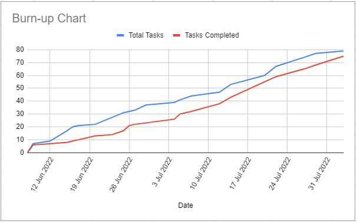

# Team Contributions
## Already Completed Work (Including times)
- Final Presentation (22 hours total)
- Final report (35 hours total)

## Work In Progress

## Work To Be Completed

## Burn Up Graph

# ** PREVIOUS WEEKS **
## Already Completed Work (Including times)
- Mock presentation (20 min)

## Work In Progress
- Final Presentation
- Final report

## Work To Be Completed

## Burn Up Graph

# Team Contributions
## Already Completed Work (Including times)
- Completed Grader DocString (2 hours)
- Completed Info Icon Crash (1 hour)
- Fix merge issues with randomgrader.py (5 hours)
- Adding docstring to randomgeneration.py (5 hours)

## Work In Progress
- Final Presentation
- Final Documentation

## Work To Be Completed
- Final report
- Get element merged into PrairieLearn codebase

## Burn Up Graph

# Team Contributions
## Already Completed Work (Including times)
- Finish exploration on RelaX (4 hours)
- Bug Fix for copying text to clipboard (2 hours)
- Finished user testing requirements (3 hours)
- Test system survey (1 hour)

## Work In Progress
- Fix merge issues with randomgrader.py
- Final Presentation
- DocStrings for random grader

## Work To Be Completed
- Final report
- Get element merged into PrairieLearn codebase

## Burn Up Graph

# Team Contributions
## Already Completed Work (Including times)
- Changed Icon for Displaying diagram to String (1 hour) - July 29th
- Add ability to highlitht text in diagram to string modal (3 hours) - July 30th
- Got DroneIO Implementaiton working with testing (2 hours) - July 30th
- Fix bugs (4 hours)
- Documentation (4 hours)
- Add docstring to randomgeneration.py (5 hours)
- Testing documentation (2.5 hours)
- Debug js bundle for RelaX implementation (4 hours)

## Work In Progress
- Join RelaX Prototype Team
- DocStrings for randomgrader.py
- Prototype importing RelaX for relational algebra

## Work To Be Completed
- Final report
- Final presentation
- Get element merged into PrairieLearn codebase

## Burn Up Graph

# Team Contributions
## Already Completed Work (Including times)
- Finished up Main Project Page/Deployment Documentation (3 hours) - July 22nd
- Run RelaX editor locally (1 hour) - July 23rd
- Finished up UML Element Documentation (4 hours) - July 25th
- Explore relax-api for RelaX implementation (3 hours) - July 25th
- Added Modal For UML to String (2 hours) - July 26th
- Improve pyunit tests for randomgrader.py (2 hours) - July 26th
- New docker rework (1 hour)
- PrairieLearn fork for client (2 hours)
- Docs (4 hours)
- Postgres persistency (5 hours)
- Multiple answers for grading (1 hour)
- Added ability to see marker feedback after final question attempt (4 hours) - July 28th
- Testing deployed questions on server (3.5 hours) - July 28th
- PrairieLearn production server (2 hours)
- Autogenerate.py unit test (17 hours)
- Autogenerate.py integration test (11.45 hours)
- Rework on testing and changing randomgeneration.py accordingly (19 hours)

## Work In Progress
- Make Setting For only displaying feedback on final attempt
- Change Icon for Displaying diagram to String
- Add ability to highlight text in diagram to string modal
- Look into Mermaid Failing Cardinalitites on Safari
- Fix bugs
- Debug js bundle for Relax implementation
- System Usability Test

## Work To Be Completed
- Join team on Relax editor
- Get element merged into PrairieLearn codebase
- Drone CI
- Get element merged into PrairieLearn codebase
- Python test documentation

## Burn Up Graph

## Already Completed Work (Including times)
- Deployed on Digital Ocean (~50 hours) - July 15th
- Fixed Cardinalities in Questions (1 hour) - 16th
- Fix label visibility. (3 hours) - July 16th
- **Implement Reverse Proxy (5 hours) - July 17th
- Final Deployment (20 hours) - July 18th
- Bring Courses to Final Deployed Instance (5 hours) - July 19th
- Docker rework (1 Hour)
- User Authentication (4 Hours)
- AutoEd Server Deployment (17 hours)
- Create tests retroactively for completed tasks (6 hours)
- Peer review Python testing (2 hours)
- Fixed Student's displayed grade (2 hours) - July 20th
- Fixed Student Link to Courses/Assessments (2 hours) - July 20th
- Run relax editor locally (1 hour) - July 21st
- Setup UBC PrairieLearn Google auth (20 mins)
- Document authentication (1 hour)

## Work In Progress
- Look into messed up student link to course instances
- PrairieLearn Docker Deployment documentation
- Testing deployed questions on server
- Investigating CWL integration
- Develop Main Project Page Documentation
- Prototype Relax Editor in PrairieLearn
- New docker rework
- PrairieLearn fork for client

## Work To Be Completed
- PrairieLearn file structure documentation
- PrairieLearn testing documentation
- PrairieLearn user guide documentation
- Look into Mermaid Failing Cardinalities on Safari

## Burn Up Graph

## Already Completed Work (Including times)
- Opentelemetry Dependancy Update (1 hour) - July 8th
- UI Bug Fix (1 hour) - July 11th
- Create pyunit tests for randomgrader.py (15 hours) - July 11th
- Import mermaid js (6 hours)
- Fix bugs (1 hour)
- Add way to style mermaid through CSS (1 hour)
- Test Log (1.5 hours)
- Deployment Documentation (1.5 hours)
- Added New Course For Demonstration (3 hours)
- Edit Mermaid CSS Styling (3 hours)

## Work In Progress
- Heroku/Digital Ocean Deployment
- Mac/Linux Deployment
- Create javascript integration tests
- Fix bugs
- Edit CSS styling for Mermaid.js
- Testing file

## Work To Be Completed
- Implement DroneIO for Continuous Integration

## Burn Up Graph

## Already Completed Work (Including times)
- Deleting Submit Answer button (4 hours) - July 1st
- Docker deployement document (3 hours) - July 3rd
- UI Fixes for HTML Element (2.5 hours) - July 4th
- MVP Work (3.5 hours) - July 5th
- Element Implementation (12 hours) - July 5th
- Test log (1.5 hours) - July 5th
- MVP Presentation (4 hours) - July 6th
- UI Fixes for UML Custom Element (4.5 hours) - July 7th
- Fix formatting (2 hours) - July 7th

## Work In Progress
- Fix bugs
- Restyle CSS
- Import mermaid.js
- Testing file
- Heroku/Digital Ocean Deployment
- Dependancy Updates
- Create pyunit tests for randomgrader.py

## Work To Be Completed
- Implement DroneIO for Continuous Integration

## Burn Up Graph

# Team Contributions
## Already Completed Work (Including times)
- Cleaned Up and Reworked Existing Autograding Code (2 hours) - June 25th
- Fix UI for Managing Relationships and Managing Entities (5 hours) - June 26th
- Fix UI for managing relationships and managing entities (2 hours) - June 26th
- Created Ability To Set Custom Grading Scema (1.5 hours) - June 27th
- Fix broken functions. (4 hours) - June 28th
- Incoporate grading system. (2 hours) - June 28th
- Incorporate student's ability to view their grade. (1 hour) - June 28th
- Fix text displacement when opening a side menu (1 hours) - June 28th

## Work In Progress
- Fix bugs
- Restyle CSS
- Fix formatting
- Fix diagram displacement when opening a side menu
- Create Custom Element of UML Generating HTML

## Work To Be Completed
- Element Implementation
- Rewrite CSS for UML question
- Implement DroneIO for Continuous Integration
- Heroku Deployment (ON HOLD due to docker changes)
- Dependancy Updates

## Burn Up Graph

# Team Contributions
## Already Completed Work (Including times)
- Recreate docker image (1 hour)
- Prototype Importing AutoEr as an I-frame in PrairieLearn. (8 hours) - June 16th
- Fix python imports (2 hours) - June 20th
- Migrate code to python for randomized question generation (6 hours) - June 20th
- Render randomized question similarily to old system (2 hours) - June 20th
- Look into TravisCI for testing (4 hours) - June 20th
- Implement TravisCI for testing (1 hour) - June 20th
- Explore DroneIO for Continuous Integration (2 hours) - June 21st

## Work In Progress
- Fix button clicks and functions to work the same as the old system
- Rewrite AutoEd backend into Server.py python script
- Set up local PrairieLearn Deployment on laptops
- Migrating Autograding functionality.
- Ensure Autograding properly sends information to PrairieLearn system.
- Implement DroneIO for Continuous Integration
- Docker Compose File for Deployement

## Work To Be Completed
- Heroku Deployment (ON HOLD due to docker changes)
- Dependancy Updates
- Prototype an element to see if it is necassary to use one.
- Import full question into PrairieLearn.
- Rewrite AutoEd backend into Server.py python script.
- Create Instructor Guide Documentation

## Burn Up Graph

# Team Contributions
## Already Completed Work (Including times)
- Project Charter Document (25 hours approximate).
- Project Design Document (25 hours approximate).
- Project Design Presentation (16 hours approximate).
- Prototype Mermaid JS (6).
- Comparison Meeting for Mermaid JS and nomnoml (1 hour).
- Edited Github to support logs (1 hour).

## Work In Progress
- Prototype importing AutoEr as an I-frame in PrairieLearn.
- Prototype creating elements and question to recreate AutoEr in PrairieLearn.
- Docker Compose File For Deployment.
- Heroku Deployment Investigations

## Work To Be Completed
- Migrating Autogeneration Script.
- Update Dependencies.
- PrairieLearn Docker Deployment Documentation.
- Implement TravisCI for testing.
- Heroku Deployment.
- Create Instructor Guide Documentation.

## Burn Up Graph

