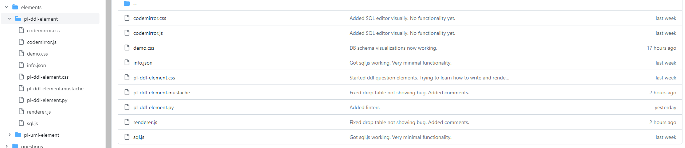

# Porting an Online SQL editor with sql.js into PrairieLearn

[sql.js repository](https://github.com/sql-js/sql.js/tree/master) 


1. Create the following files in your elements/pl-custom-element folder.
    - pl-custom-element.mustache
    - pl-custom-element.css
    - pl-custom-element.py
    - renderer.js
    - info.json

1. HTML text for editor retrieved from: https://github.com/sql-js/sql.js/blob/master/examples/GUI/index.html. This text is placed in a .mustache file inside your elements folder.
1. Retrieve codemirror.css from https://cdnjs.cloudflare.com/ajax/libs/codemirror/5.58.1/codemirror.css and place inside your elements folder.
1. Retrieve codemirror.js from https://cdnjs.cloudflare.com/ajax/libs/codemirror/5.58.1/codemirror.js and place inside your elements folder.
1. Retrieve sql.js from https://github.com/sql-js/sql.js/tree/master and place inside your elements folder.
1. Your pl-custom-element folder should look as follows: 
1. The inside of your info.json file should looks similar to:
```
{
    "controller": "pl-ddl-element.py",
    "dependencies": {
        "elementScripts": [
            "renderer.js", "codemirror.js", "sql.js"
        ],
        "elementStyles": [
            "pl-ddl-element.css", "demo.css", "codemirror.css"
        ]
    }
}
```
### The renderer.js file needs the following code to use the sql.js API that turns SQLite code into JavaScript allowing for SQLite databases within the browser.
```
    let config = {
        locateFile: () => {
            "https://cdnjs.cloudflare.com/ajax/libs/sql.js/1.8.0/sql-wasm.wasm"
        }
    }

    var db;
    // Initialize the db with sql.js
    initSqlJs(config).then(function (SQL) {
        console.log("sql.js initialized 🎉");

        db = new SQL.Database();

    });
```
### The pl-custom-element.py handles all of the element rendering. You will need to follow PrairieLearn's documentation on how to render the mustache file. A very basic example of this can look as follows:
```
import json
import chevron
import lxml.html
import prairielearn as pl


def render(element_html, data):
    '''
    Renders the question, submission and answer into PrairieLearn.
    This function is called by PrairieLearn during the page load.
    
    Keyword arguments:
    :param element_html: The element HTML
    :param data: The data
    :return: The HTML you want rendered
    '''

    
    element = lxml.html.fragment_fromstring(element_html)
     
    # This renders the question into PL
    if data['panel'] == 'question':  
        z = pl.inner_html(element[0])
        html_params = {
            'questionText' : z
        }
    
        with open('pl-ddl-element.mustache', 'r') as f:
            html = chevron.render(f, html_params)
        
    # This renders the users submitted answer into the "Submitted answer" box in PL
    elif data['panel'] == 'submission':
        html = "Submitted string"
    
    # This renders the correct answer into the "Correct answer" box in PL
    # This will not be displayed on the student page unless a showCorrectAnswer: True 
    # is specified in the info.json file.
    elif data['panel'] == 'answer':
        correctAnswer = pl.inner_html(element[1])
        html = correctAnswer
    
    return html
```
  
  
### sql.js API documentation can be found here: https://sql.js.org/documentation/
